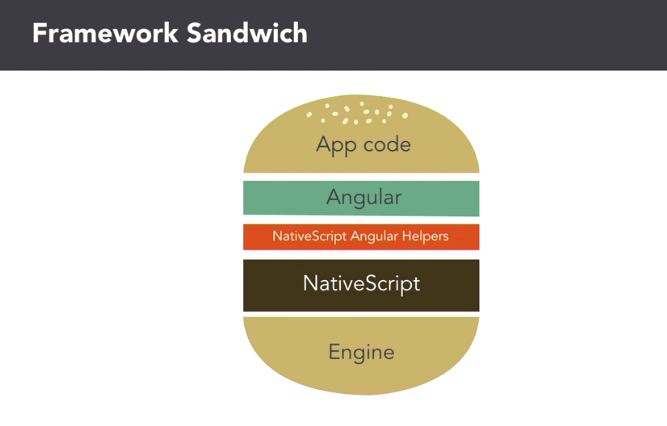

# NativeScript Angular2 Exercises #

Exercises from `Building Native Mobile Apps with NativeScript and Angular` 2 course

- Course on [LinkedIn][1] by [Alex Ziskind][2]
- Author from this repo: [Francis Rodrigues][3]

## Concepts ##

### NativeScript Technologies ###

- JavaScript
- TypeScript
- TypeScript with Angular

### Benefits ###

- Native UI Performance
- 100% native API acess
- NPM or yarn
- CocoaPods
- Gradle

### JavaScript Engines ###

Always up to date

- JavaScriptCore on iOS
- V8 on Android

## Using Angular with NativeScript ##

- Angular is not mandatory for NativeScript applications
- NativeScript integrates seamlessly with Angular

## Is a Platform Agnostic ##

- works with browsers
- works without browsers as NativeScript framework

## Angular Component Rules ##

- Interacts with host
- Renders itself
- Configures dependency injection
- Defines its own inputs and outputs
- Has a well-defined life cycle

## References ##

- [NativeScript][4]

## License ##

MIT

  [1]: https://www.linkedin.com/learning/building-native-mobile-apps-with-nativescript-and-angular-2
  [2]: https://www.linkedin.com/learning/instructors/alex-ziskind
  [3]: https://github.com/francisrod01
  [4]: https://www.nativescript.org/
