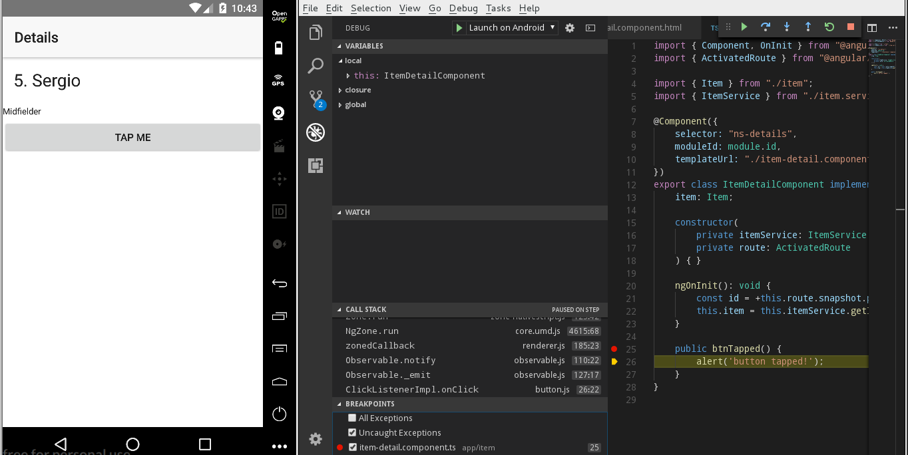

# Rpspt app #

Build an application with NativeScript.

## How to debug this app ##

```bash
# NativeScript Debugger started #
To start debugging, open the following URL in Chrome:
chrome-devtools://devtools/bundled/inspector.html?experiments=true&ws=localhost:40000
```

## Visual Studio Code extensions ##

- NativeScript Extension for Visual Studio Code
- NativeScript + Angular Snippets for Visual Studio Code
- VSCode Angular TypeScript & Html Snippets

**Screenshot:**



## NativeScript Angular Modules ##

- Bootstrap
- Platform
- Routing
- Forms

**app/main.ts** file:

```ts
// this import should be first in order to load some required settings (like globals and reflect-metadata)
import { platformNativeScriptDynamic } from "nativescript-angular/platform";

import { AppModule } from "./app.module";

// A traditional NativeScript application starts by initializing global objects, setting up global CSS rules, creating, and navigating to the main page.

// Angular applications need to take care of their own initialization: modules, components, directives, routes, DI providers.

// A NativeScript Angular app needs to make both paradigms work together, so we provide a wrapper platform object, platformNativeScriptDynamic,
// that sets up a NativeScript application and can bootstrap the Angular framework.
platformNativeScriptDynamic().bootstrapModule(AppModule);
```

**app/app.routing.ts** file:

```ts
...
import { NativeScriptRouterModule } from "nativescript-angular/router";
import { Routes } from "@angular/router";

...

const routes: Routes = [...];

@NgModule({
    imports: [NativeScriptRouterModule.forRoot(routes)],
    exports: [NativeScriptRouterModule]
})
export class AppRoutingModule { }
```

## License ##

MIT
